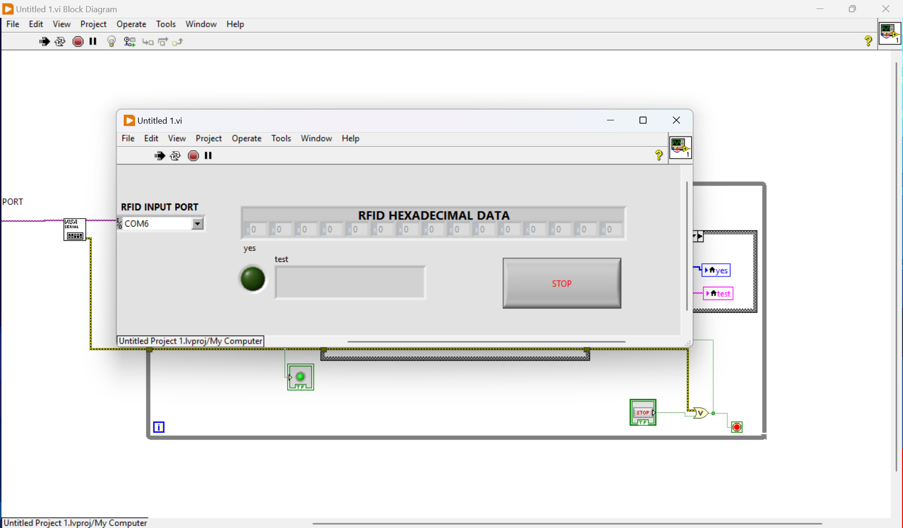
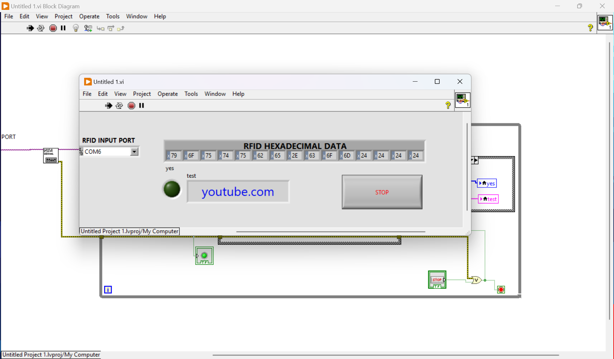
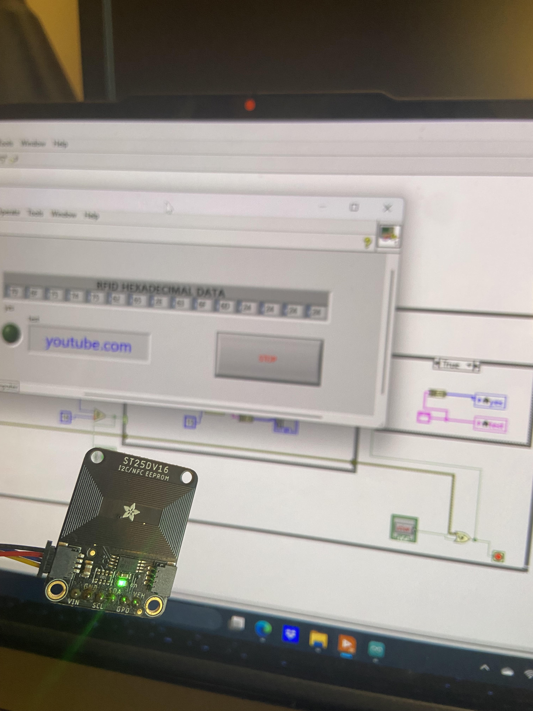

# RFID tag information reader
RFID tag reader project in LabVIEW displays information hidden in memory of physical programmable RFID tag (in my case ST25DV16).

Before tag was read:

After tag was read:

"youtube.com" webpage is used as an showcase example.

How it was done?
1. Code written in C language in Arduino envionment. ST25DV16 after detection of memory information change, sends 16 bytes of data on serial port.
2. Data is then collected by my program in LabVIEW.
3. Data is displayed in raw form as an array of hexadecimal numbers.
4. Hexadeciaml numbers can be easily converted to characters by applying rules of ASCII table, therefore human-readable characters are also displayed in read window showing the valuable piece of information.

Tag was programmed by NFC Tools application on iPhone 11.

RFID tag ST25DV16:

